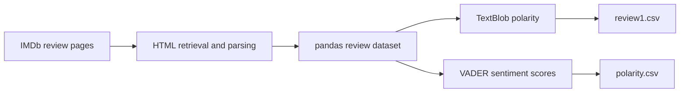

<picture>
  
</picture>

**Collaborative coursework · Sentiment analysis**

[Profile](https://github.com/Ramtin-Mojtahedi) · [Project directory](https://github.com/Ramtin-Mojtahedi/Ramtin-Mojtahedi/blob/main/REPOSITORY_INDEX.md)

# Assignment 4 — Sentiment Analysis

Archived collaborative coursework by Albin Baby and Ramtin Mojtahedi.

## Notebook

- [Open the sentiment-analysis notebook](./Assignment_4_Sentiment_Analysis_Albin_and_Ramtin.ipynb)

## Workflow

## Observed environment

| Layer | Packages |
|---|---|
| Web retrieval | `requests`, `beautifulsoup4` |
| Data | `pandas` |
| Sentiment | `textblob`, `vaderSentiment` |
| Runtime | Python 3 with Jupyter/Colab |

> **Historical note:** the notebook reads live IMDb markup, so its scraping cells may require adaptation if the website structure has changed. No package versions are asserted, and the original notebook is preserved unchanged.
